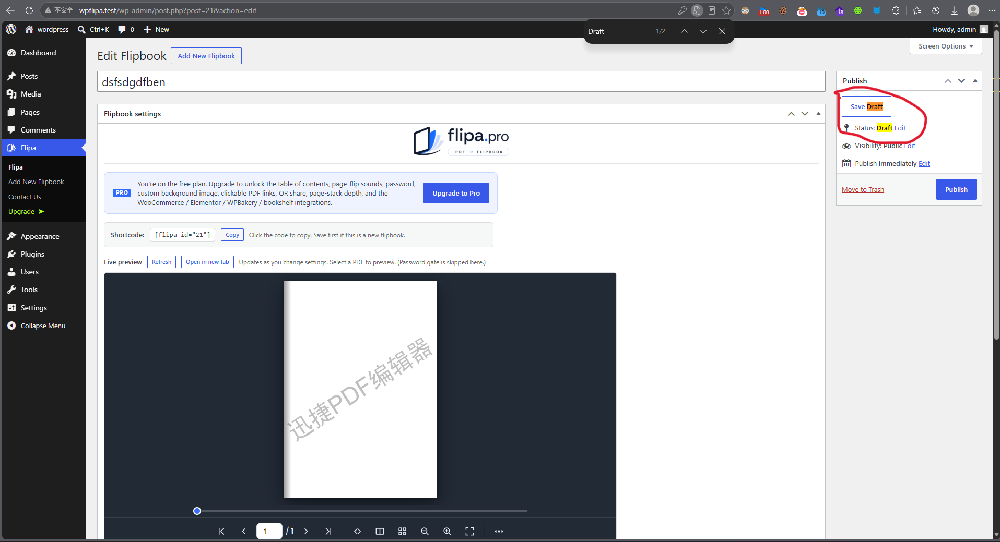
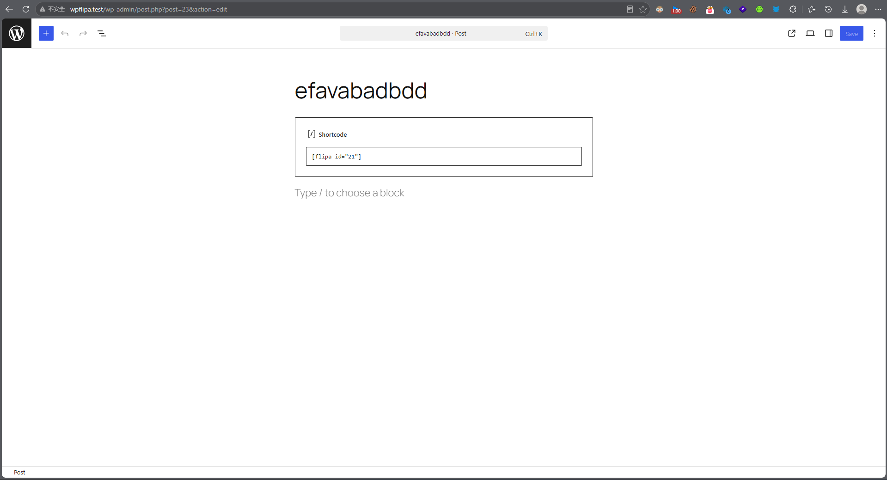
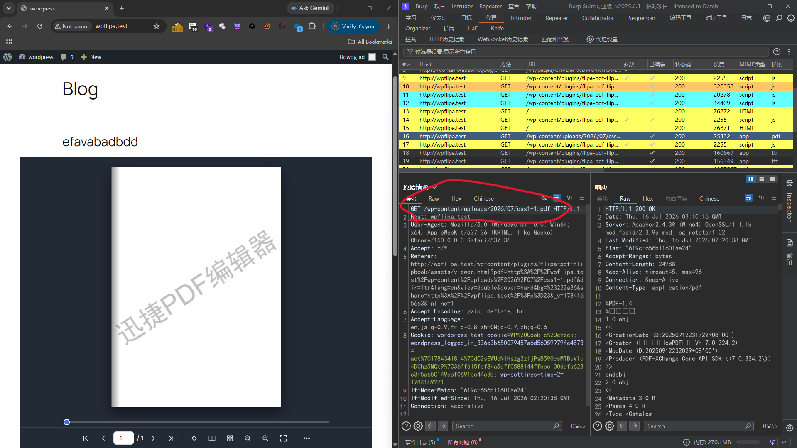
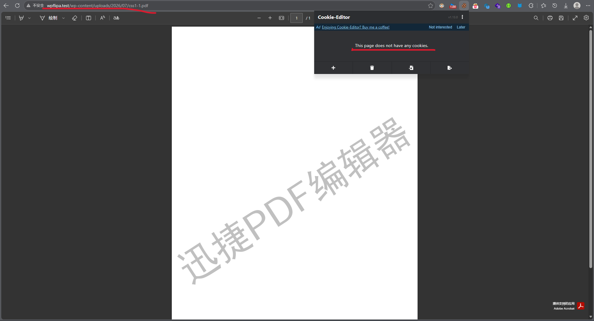

# wPlugin-flipa-IDOR-report
# IDOR / Broken Access Control + Sensitive Data Exposure

[Flipa — PDF Flipbook 0.18.3] IDOR + Broken Access Control - Unauthenticated Access to Private/Draft Flipbooks and Direct PDF Download

**Vulnerability Type:** Broken Access Control (CWE-639), Information Disclosure (CWE-200)

**CVSS 3.1 Vector:** **CVSS:3.1/AV:N/AC:L/PR:L/UI:N/S:U/C:H/I:N/A:N** **Base Score: 6.5 Medium**

**Description:** The render_book() function in flipa-pdf-flipbook/includes/class-flipa-render.php:137 only checks get_post_type($id) without verifying post_status === 'publish' or current_user_can('read_post', $id).

An authenticated user with **Author** privileges (or lower if they can publish posts) can embed a draft/private flipbook using the shortcode [flipa id="xxx"] or Gutenberg block. Any visitor (including unauthenticated users) accessing the page can view the flipbook and obtain the direct PDF URL.

**Proof of Concept:**

1. Create a flipbook with a PDF (set to draft).

   

2. Embed it in a published post/page.

   

3. Unauthenticated visitor accesses the page → PDF direct link is exposed (e.g. http://wpflipa.test/wp-content/uploads/2026/07/css1-1.pdf).

   

4. The PDF can be downloaded directly without authentication.

   

**Impact:** Private, draft, or other users' confidential PDFs can be accessed and downloaded by anyone.
